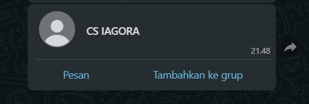
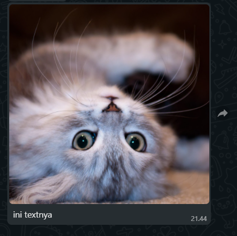
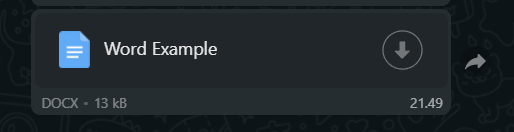

# WA-API

##### *Postman Example : <a href="https://github.com/IAGORA-Project/BE-API/blob/main/imageReadme/WA-API.postman_collection.json" target="__blank">imageReadme/WA-API.postman_collection.json</a>*

### Session WhatsApp

Menggunakan Session Dengan Nomer WhatsApp ([6287715579967](wa.me/6287715579967))

Jika Ingin Coba Menggunakan Nomer Sendiri Silahkan Hapus/Rename File session.json

`NOTE : Pada Saat Mencoba Jangan Gunakan Nomer Utama/Penting, Rawan Terjadinya Ban WhatsApp`

## Running App

```cmd
> npm install
> npm start
```

# API

|     API              |
| :--------------:     |
| Send Text Message    |
| Send Image           |
| Send Video           |
| Send Audio           |
| Send Document        |

#### Base URL : http://185.201.9.239:8001

# Example


### 1. Send Text
URL : `${BASE_URL}/api/v1/send?no=79648301411&text=testt`

##### METHOD : GET

**Query : no & text**

`no` : Nomer Target

`text` : Pesan Yang Akan Dikirim

**Example Response**
```
{
    "status": true,
    "text": "testt",
    "message": "Send Message to 79648301411"
}
```


### 2. Send Contact
URL : `${BASE_URL}/api/v1/sendcontact?no=79648301411&contact=6281346832542&name=CS IAGORA`

##### METHOD : GET

**Query : no, contact & name**

`no` : Nomer Target

`contact` : Kontak Yang Ingin Dikirim

`name` : Nama Kontak

**Example Response**
```
{
    "status": true,
    "message": "Send Contact 6281346832542 to 79648301411 with name CS IAGORA"
}
```



### 3. Send Image
URL : `${BASE_URL}/api/v1/sendfile?no=79648301411&text=ini textnya&type=image`

##### METHOD : POST

**Body (form-data) : png/jpg**

**text : no, text & type**

`no` : Nomer Target

`text` : Pesan Yang Akan Dikirim

`type` : Tipe File `image`

**Example Response**
```
{
    "status": true,
    "result": {
        "target": "79648301411",
        "type": "image",
        "caption": "ini textnya",
        "originalname": "cat.jpg",
        "mimetype": "image/jpeg",
        "size": 145492,
        "result_base64": "data:image/jpeg;base64,/9j/4AAQSkZJRgABAQAAAQABAAD/...
    }
}
```



### 4. Send Video
URL : `${BASE_URL}/api/v1/sendfile?no=79648301411&text=ini textnya video&type=video`

##### METHOD : POST

**Body (form-data) : mp4**

**text : no, text & type**

`no` : Nomer Target

`text` : Pesan Yang Akan Dikirim

`type` : Tipe File `image`

**Example Response**
```
{
    "status": true,
    "result": {
        "target": "79648301411",
        "type": "video",
        "caption": "ini textnya video",
        "originalname": "file_example_MP4_480_1_5MG.mp4",
        "mimetype": "video/mp4",
        "size": 1570024,
        "result_base64": "data:video/mp4;base64,AAAAIGZ0eXBtcDQyAAAAAG1wNDJtcDQxaXNvbWF2YzEAAC4w...
    }
}
```


### 5. Send Document
URL : `${BASE_URL}/api/v1/sendfile?no=79648301411&type=document&filename=Word Example`

##### METHOD : POST

**Body (form-data) : ppt/doc/text/dll**

**text : no, type & filename**

`no` : Nomer Target

`type` : Tipe File `image`

`filename` : Nama File Yang Akan Dikirim

**Example Response**
```
{
    "status": true,
    "result": {
        "target": "79648301411",
        "type": "document",
        "filename": "Word Example",
        "caption": "",
        "originalname": "Dokumen.docx",
        "mimetype": "application/vnd.openxmlformats-officedocument.wordprocessingml.document",
        "size": 13460,
        "result_base64": "data:application/vnd.openxmlformats-officedocument.wordprocessingml.document;base64,UEsDBBQABgAIAAAAIQCaV14JZwEAALAFAAATAA...
    }
}
```



### 6. Send Audio
URL : `${BASE_URL}/api/v1/sendfile?no=79648301411&type=audio&filename=test`

##### METHOD : POST

**Body (form-data) : ppt/doc/text/dll**

**text : no, type & filename**

`no` : Nomer Target

`type` : Tipe File `image`

`filename` : Nama File Yang Akan Dikirim

**Example Response**
```
{
    "status": true,
    "result": {
        "target": "79648301411",
        "type": "audio",
        "filename": "test",
        "caption": "",
        "originalname": "file_example_MP3_700KB.mp3",
        "mimetype": "audio/mpeg",
        "size": 764176,
        "result_base64": "data:audio/mpeg;base64,SUQzAwAAAAAAZlRDT04AAAAKAAAAQ2luZW1hdGljVEF...
    }
}
```


## Fitur Lainnya
**Exec Terminal**
Untuk Memudahkan Dalam Mengatur Session WhatsApp
Example :

`$pm2 restart index.js`

`$npm i <package npm>`

